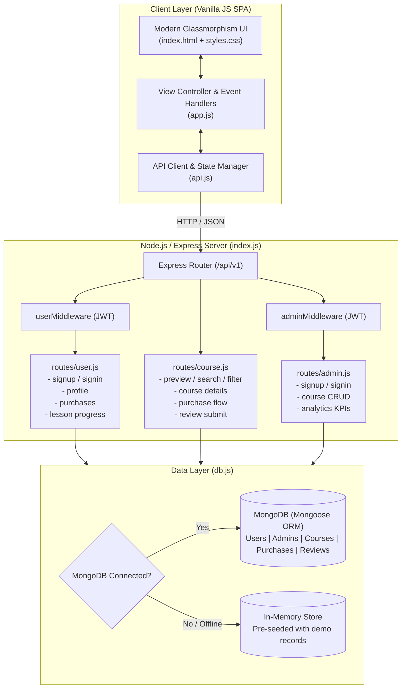

# Lumina Learn — Full-Stack Course Selling & Learning Marketplace

A full-stack, production-ready course selling platform and student learning management system built with **Node.js**, **Express**, and **MongoDB / Mongoose**, paired with a custom dark-mode SPA frontend.

Includes separate role-based portals for students and instructors, JWT authentication, lesson progress tracking, course reviews, revenue analytics, an automated test harness, and an in-memory fallback engine that lets you run and test the app immediately even without a local MongoDB instance running.

---

## Quick Access & Live Links

- **Live Application Demo:** [https://course-selling-app-ariba.onrender.com](https://course-selling-app-ariba.onrender.com)
- **GitHub Repository:** [https://github.com/aribanaz11/Course-Selling-App](https://github.com/aribanaz11/Course-Selling-App)
- **Local Dev Server:** `http://localhost:30001` (or your configured `PORT`)

### Demo Credentials

The database seeds automatically on boot with two accounts for testing both workflows:

| Role | Email | Password | What you can test |
| :--- | :--- | :--- | :--- |
| **Student** | `student@demo.com` | `password123` | Course discovery, instant purchase, lesson player, progress tracking, submitting course reviews |
| **Admin / Instructor** | `admin@demo.com` | `password123` | Creator Studio, platform revenue KPIs, student enrollment stats, creating & editing courses and curriculum |

*(Tip: You can also use the 1-click login chips in the top notification bar to sign in instantly without typing).*

---

## Why this was built & Technical Highlights

1. **Dual JWT Role-Based Access Control (RBAC)**
   - Independent secret keys for students (`JWT_USER_PASSWORD`) and instructors (`JWT_ADMIN_PASSWORD`).
   - Tokens carry role claims and are validated through dedicated Express middleware (`userMiddleware`, `adminMiddleware`) supporting both `Authorization: Bearer <token>` and `token: <token>` headers.

2. **Resilient Data Layer (Hybrid MongoDB + In-Memory Store)**
   - When MongoDB is running, Mongoose models handle persistence with schema validation, indexing, and document relations.
   - If MongoDB is unreachable (e.g. during quick local dev or CI), the app catches the connection timeout and seamlessly falls back to a high-performance in-memory mock store populated with realistic seed courses, reviews, and admin data. No crash, no complex local database setup required.

3. **Complete Student Learning Lifecycle**
   - Browse catalog with real-time multi-filter (category, search query, difficulty level, price/popularity/rating sort).
   - Video modal player with modular curriculum (sections and lessons).
   - Automatic percentage calculation upon completing individual lessons.
   - Course review submission with dynamic average rating recalculation.

4. **Instructor Studio & Analytics**
   - Live calculations for total revenue, unique active students, overall sales, and average course ratings.
   - Full course CRUD with nested curriculum builder (sections, video URLs, duration, preview flags).

---

## Architecture Overview



---

## Database Schemas & Data Model

The data layer in [`db.js`](file:///c:/Users/Admin/Course-Selling-App/db.js) defines five Mongoose schemas:

- **`User`**: `email` (unique, lowercase), `password` (bcrypt hash), `firstName`, `lastName`, `avatar`, `role`, `createdAt`.
- **`Admin`**: `email` (unique), `password` (bcrypt hash), `firstName`, `lastName`, `avatar`, `title`, `bio`, `createdAt`.
- **`Course`**:
  - `title`, `subtitle`, `description`, `price`, `originalPrice`, `imageUrl`, `category`, `level`, `duration`, `lessonsCount`
  - `rating`, `reviewsCount`, `enrolledCount`, `instructorId`, `instructorName`, `instructorAvatar`, `highlights[]`, `tags[]`, `featured`, `bestseller`
  - `curriculum`: Array of sections, each containing `title` and `lessons[]` (`title`, `duration`, `videoUrl`, `summary`, `isPreview`).
- **`Purchase`**: `userId` (ref User), `courseId` (ref Course), `pricePaid`, `purchasedAt`, `status`, `completedLessons[]`, `progressPercentage`.
- **`Review`**: `courseId` (ref Course), `userId` (ref User), `userName`, `userAvatar`, `rating` (1-5), `comment`, `createdAt`.

---

## REST API Reference

### 1. Public Endpoints

| Method | Endpoint | Description | Query / Body Parameters |
| :--- | :--- | :--- | :--- |
| `GET` | `/api/health` | Service health & uptime status | None |
| `GET` | `/api/v1/course/preview` | Filter & search courses | `?category=Web+Development&search=nextjs&level=All&sort=price-low` |
| `GET` | `/api/v1/course/categories` | Grouped categories with counts | None |
| `GET` | `/api/v1/course/:id` | Course detail and its reviews | Route param `:id` |
| `POST` | `/api/v1/user/signup` | Student registration | `email`, `password`, `firstName`, `lastName` |
| `POST` | `/api/v1/user/signin` | Student login (returns JWT) | `email`, `password` |
| `POST` | `/api/v1/admin/signup` | Instructor registration | `email`, `password`, `firstName`, `lastName`, `title`, `bio` |
| `POST` | `/api/v1/admin/signin` | Instructor login (returns JWT) | `email`, `password` |

### 2. Student Endpoints (Header: `Authorization: Bearer <user_token>`)

| Method | Endpoint | Description | Body Parameters |
| :--- | :--- | :--- | :--- |
| `GET` | `/api/v1/user/profile` | Current user profile | None |
| `PUT` | `/api/v1/user/profile` | Update profile fields | `firstName`, `lastName`, `avatar` |
| `GET` | `/api/v1/user/purchases` | List user's enrolled courses | None |
| `POST` | `/api/v1/course/purchase` | Enroll in a course | `{ "courseId": "..." }` |
| `POST` | `/api/v1/course/:id/review` | Submit course review & rating | `{ "rating": 5, "comment": "Great course!" }` |
| `POST` | `/api/v1/user/progress` | Mark lesson completed & update progress % | `{ "courseId": "...", "lessonId": "..." }` |

### 3. Instructor Endpoints (Header: `Authorization: Bearer <admin_token>`)

| Method | Endpoint | Description | Body Parameters |
| :--- | :--- | :--- | :--- |
| `GET` | `/api/v1/admin/profile` | Instructor profile | None |
| `GET` | `/api/v1/admin/analytics` | Revenue, enrollment & sales metrics | None |
| `GET` | `/api/v1/admin/course/bulk` | All courses created by instructors | None |
| `POST` | `/api/v1/admin/course` | Create a new course | Full course object (title, price, description, curriculum, etc.) |
| `PUT` | `/api/v1/admin/course/:id` | Update an existing course | Updated fields |
| `DELETE` | `/api/v1/admin/course/:id` | Remove course from marketplace | Route param `:id` |

---

## Local Setup & Development

### Prerequisites
- **Node.js** >= 18.0.0
- **npm** >= 9.0.0
- *(Optional)* **MongoDB** running on `mongodb://127.0.0.1:27017`

### 1. Clone & Install
```bash
git clone https://github.com/aribanaz11/Course-Selling-App.git
cd Course-Selling-App
npm install
```

### 2. Configure Environment
```bash
cp .env.example .env
```
Default `.env` configuration:
```env
PORT=30001
MONGO_URL=mongodb://127.0.0.1:27017/course_app
JWT_USER_PASSWORD=lumina_user_secret_key_2026
JWT_ADMIN_PASSWORD=lumina_admin_secret_key_2026
```

### 3. Run the App
- **Development (with hot-reload via nodemon):**
  ```bash
  npm run dev
  ```
- **Production start:**
  ```bash
  npm start
  ```
Open `http://localhost:30001` in your browser.

---

## Running the Automated Test Suite

The repository includes a self-contained integration test harness in [`test.js`](file:///c:/Users/Admin/Course-Selling-App/test.js). It starts an isolated in-process test server and runs 13 end-to-end assertions against the REST API:

```bash
npm test
```

Expected output:
```text
===============================================================
 🧪 Lumina Learn Automated Integration Test Suite
===============================================================

 ✔ PASS: Health Check returns 200 OK & healthy status
 ✔ PASS: Course Preview endpoint returns courses array
 ✔ PASS: Course Categories endpoint returns grouped list
 ✔ PASS: Demo Student signin authenticates & returns JWT
 ✔ PASS: User Profile endpoint returns authenticated student data
 ✔ PASS: User Purchases endpoint returns list of enrolled courses
 ✔ PASS: Demo Admin signin authenticates & returns JWT
 ✔ PASS: Admin Analytics endpoint calculates platform metrics
 ✔ PASS: Admin Bulk Courses endpoint returns all courses
 ✔ PASS: Admin can create & publish a new course
 ✔ PASS: Student can successfully purchase and enroll in course
 ✔ PASS: Student can post a rating and review on the course
 ✔ PASS: Student can mark lessons complete and update progress

===============================================================
 🏁 Test Suite Completed: 13 Passed, 0 Failed
===============================================================
```

---

## Deployment Options

### 1. Render (1-Click Blueprint)
The repo contains [`render.yaml`](file:///c:/Users/Admin/Course-Selling-App/render.yaml). In your Render dashboard:
1. Click **New +** ➔ **Blueprint**.
2. Connect `aribanaz11/Course-Selling-App`.
3. Render automatically sets up build commands, health check endpoints, and starts the service.

### 2. Docker
Build and run a standalone container:
```bash
docker build -t lumina-course-app .
docker run -p 3000:3000 --name lumina-app lumina-course-app
```

### 3. Docker Compose (App + MongoDB)
Spin up both the Node.js application and a MongoDB instance with persistent volume storage:
```bash
docker compose up -d
```

### 4. Vercel
Configured via [`vercel.json`](file:///c:/Users/Admin/Course-Selling-App/vercel.json) to route API calls to `index.js` and serve frontend assets statically.

---

## Project Structure

```text
Course-Selling-App/
├── .env.example          # Template for environment variables
├── .gitignore            # Excludes node_modules, .env, and logs
├── Dockerfile            # Lightweight Alpine container configuration
├── docker-compose.yml    # Multi-container orchestration (App + MongoDB)
├── render.yaml           # Infrastructure-as-code for Render deployment
├── vercel.json           # Serverless routing config for Vercel
├── README.md             # Project documentation & API guide
├── config.js             # Environment variable loader
├── db.js                 # Schemas, seed loader & hybrid query layer
├── index.js              # Express app, middleware stack & route bindings
├── package.json          # Dependencies, metadata & test script
├── test.js               # Automated integration test harness
├── middleware/
│   ├── admin.js          # Instructor JWT validation & claims extraction
│   └── user.js           # Student JWT validation & claims extraction
├── routes/
│   ├── admin.js          # Instructor auth, course CRUD & analytics routes
│   ├── course.js         # Public course discovery, purchase & review routes
│   └── user.js           # Student auth, profile & progress routes
└── public/               # Frontend SPA
    ├── index.html        # Semantic HTML layout, modals & templates
    ├── css/
    │   └── styles.css    # Responsive dark-theme design system & animations
    └── js/
        ├── api.js        # API wrapper, token persistence & toast manager
        └── app.js        # UI controller, course filtering & video player
```

---

## Contributing

1. Fork the project.
2. Create your feature branch: `git checkout -b feature/my-feature`.
3. Commit your changes: `git commit -m "feat: add my new feature"`.
4. Verify with test suite: `npm test`.
5. Push to branch: `git push origin feature/my-feature`.
6. Open a Pull Request.

---

## License

MIT License — see [LICENSE](file:///c:/Users/Admin/Course-Selling-App/LICENSE) for details.
