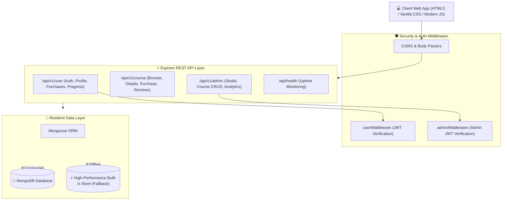

<div align="center">

# ⚡ Lumina Learn — Full-Stack Course Selling & Learning Marketplace

[](https://course-selling-app-ariba.onrender.com)
[](https://github.com/aribanaz11/Course-Selling-App)
[](https://nodejs.org/)
[](https://expressjs.com/)
[](https://mongoosejs.com/)
[](https://jwt.io/)
[](https://www.docker.com/)
[](https://opensource.org/licenses/MIT)

<p align="center">
  A state-of-the-art, full-stack EdTech course platform and marketplace built with modern Node.js, Express, MongoDB/Mongoose, JWT authentication, and a responsive frontend with dark-mode glassmorphism aesthetics.
</p>

### 🔗 [👉 Launch Live Web Application 👈](https://course-selling-app-ariba.onrender.com) 🔗

[Live Links](#-live-links--demo-access) •
[Features](#-key-features) •
[Quickstart](#-quickstart-guide) •
[Demo Credentials](#-instant-demo-accounts) •
[API Reference](#-api-documentation) •
[Architecture](#-system-architecture) •
[Contributing](#-contributing)

</div>

---

## 🌐 Live Links & Demo Access

| Environment | Link / URL | Description |
| :--- | :--- | :--- |
| **🚀 Production Cloud App** | **[https://course-selling-app-ariba.onrender.com](https://course-selling-app-ariba.onrender.com)** | Hosted live on Cloud Platform |
| **💻 Local Environment** | `http://localhost:30001` or `http://localhost:3000` | Run locally with `npm start` |
| **🐙 GitHub Repository** | **[github.com/aribanaz11/Course-Selling-App](https://github.com/aribanaz11/Course-Selling-App)** | Complete Open-Source Codebase |

---

## 🚀 Instant Demo Accounts

You can test drive the entire application immediately using the live demo chips in the header or with the following credentials:

| Role | Email | Password | Access Capabilities |
| :--- | :--- | :--- | :--- |
| **🎓 Student** | `student@demo.com` | `password123` | Browse catalog, enroll in courses, track lesson progress, submit reviews |
| **👑 Admin / Instructor** | `admin@demo.com` | `password123` | Creator Studio, publish courses, view revenue analytics, edit curriculum |

---

## 🌟 Key Features

### 🎓 Student Experience
- **Interactive Course Catalog**: Real-time multi-criteria filtering by category, search keywords, difficulty level, and sorting (price, popularity, rating).
- **Rich Course Detail Modals**: High-definition preview player, curriculum breakdown with duration badges, instructor bios, student reviews, and highlights.
- **One-Click Enrollment & Checkout**: Streamlined instant purchase flow with payment simulation.
- **My Learning Dashboard**: Real-time progress percentage, lesson checklist, and video learning classroom.
- **Course Ratings & Reviews**: Leave feedback and dynamically recalculate course community ratings.

### 👑 Instructor & Creator Studio
- **Executive Analytics Dashboard**: Instant KPIs tracking Gross Revenue, Active Enrolled Students, Total Sales, and Average Platform Rating.
- **Course Publishing Suite**: Modal-based course creator with curriculum section/lesson builders, pricing, badges (Bestseller/Featured), and tags.
- **Course Management & CRUD**: Edit live course titles, pricing, descriptions, and delete deprecated content.
- **Individual Course Performance**: Granular revenue and enrollment tracking per course.

### 🛡️ Architecture & Security
- **Dual JWT RBAC**: Independent cryptographically signed tokens for students and admin instructors.
- **Password Hashing**: Secure salted bcrypt password hashing.
- **Graceful High-Performance Fallback**: Built-in in-memory fallback layer with realistic seed data — runs out-of-the-box even without a local MongoDB daemon installed!
- **Containerized**: Production-ready `Dockerfile`, `docker-compose.yml`, and `render.yaml`.

---

## 📐 System Architecture



---

## 💻 Quickstart Guide

### Prerequisites
- [Node.js](https://nodejs.org/) (v18 or higher)
- [npm](https://www.npmjs.com/) (v9 or higher)
- *(Optional)* [MongoDB](https://www.mongodb.com/) (if offline, the app runs smoothly with the built-in resilient data engine)

### 1. Clone the Repository
```bash
git clone https://github.com/aribanaz11/Course-Selling-App.git
cd Course-Selling-App
```

### 2. Install Dependencies
```bash
npm install
```

### 3. Configure Environment Variables
Copy the sample environment file:
```bash
cp .env.example .env
```
Default `.env` settings:
```env
PORT=3000
MONGO_URL=mongodb://127.0.0.1:27017/course_app
JWT_USER_PASSWORD=lumina_user_secret_key_2026
JWT_ADMIN_PASSWORD=lumina_admin_secret_key_2026
```

### 4. Run the Application
#### Development Mode (with hot-reload):
```bash
npm run dev
```
#### Production Mode:
```bash
npm start
```

Visit **`http://localhost:3000`** in your browser!

---

## 🧪 Automated Testing

The project includes an end-to-end integration test suite that tests all 13 core REST API endpoints (authentication, course creation, enrollment, reviews, analytics):

```bash
npm test
```

Sample test output:
```text
===============================================================
 🧪 Lumina Learn Automated Integration Test Suite
===============================================================

 ✔ PASS: Health Check returns 200 OK & healthy status
 ✔ PASS: Course Preview endpoint returns courses array
 ✔ PASS: Course Categories endpoint returns grouped list
 ✔ PASS: Demo Student signin authenticates & returns JWT
 ✔ PASS: User Profile endpoint returns authenticated student data
 ✔ PASS: User Purchases endpoint returns list of enrolled courses
 ✔ PASS: Demo Admin signin authenticates & returns JWT
 ✔ PASS: Admin Analytics endpoint calculates platform metrics
 ✔ PASS: Admin Bulk Courses endpoint returns all courses
 ✔ PASS: Admin can create & publish a new course
 ✔ PASS: Student can successfully purchase and enroll in course
 ✔ PASS: Student can post a rating and review on the course
 ✔ PASS: Student can mark lessons complete and update progress

===============================================================
 🏁 Test Suite Completed: 13 Passed, 0 Failed
===============================================================
```

---

## 🐳 Docker Deployment

You can build and run the entire application inside a Docker container:

```bash
# Build the Docker image
docker build -t lumina-course-app .

# Run the container
docker run -p 3000:3000 --name lumina-app lumina-course-app
```

Or deploy both the app and a MongoDB cluster using Docker Compose:
```bash
docker compose up -d
```

---

## 📡 API Documentation

### 🔓 Public Endpoints
| Method | Route | Description |
| :--- | :--- | :--- |
| `GET` | `/api/health` | Health check and uptime status |
| `GET` | `/api/v1/course/preview` | Browse all courses with search, category, and sort queries |
| `GET` | `/api/v1/course/categories` | Retrieve all course categories and counts |
| `GET` | `/api/v1/course/:id` | Get detailed course view and reviews |
| `POST` | `/api/v1/user/signup` | Register a new student account |
| `POST` | `/api/v1/user/signin` | Sign in student and receive JWT token |
| `POST` | `/api/v1/admin/signup` | Register a new instructor account |
| `POST` | `/api/v1/admin/signin` | Sign in instructor and receive Admin JWT token |

### 🎓 Student Endpoints *(Requires User Bearer Token)*
| Method | Route | Description |
| :--- | :--- | :--- |
| `GET` | `/api/v1/user/profile` | Fetch authenticated student profile |
| `PUT` | `/api/v1/user/profile` | Update student profile information |
| `GET` | `/api/v1/user/purchases` | Fetch enrolled courses and progress |
| `POST` | `/api/v1/course/purchase` | Enroll and purchase a course |
| `POST` | `/api/v1/course/:id/review` | Submit a course rating (1-5) and review |
| `POST` | `/api/v1/user/progress` | Mark lesson completed and update progress percentage |

### 👑 Admin / Creator Endpoints *(Requires Admin Bearer Token)*
| Method | Route | Description |
| :--- | :--- | :--- |
| `GET` | `/api/v1/admin/profile` | Fetch instructor profile details |
| `GET` | `/api/v1/admin/analytics` | Retrieve platform revenue, sales, and student metrics |
| `GET` | `/api/v1/admin/course/bulk` | Retrieve all courses managed by instructor |
| `POST` | `/api/v1/admin/course` | Publish a new course with curriculum |
| `PUT` | `/api/v1/admin/course/:id` | Update an existing course |
| `DELETE` | `/api/v1/admin/course/:id` | Delete a course from marketplace |

---

## 📂 Project Structure

```text
Course-Selling-App/
├── .env.example          # Environment variable template
├── .gitignore            # Git ignore definitions
├── Dockerfile            # Docker container definition
├── docker-compose.yml    # Full-stack container composition
├── render.yaml           # 1-Click Render blueprint
├── vercel.json           # Vercel deployment configuration
├── README.md             # Project documentation with live links
├── config.js             # Configuration loader
├── db.js                 # Mongoose schemas & fallback data engine
├── index.js              # Express app server and entry point
├── package.json          # Node.js dependencies & scripts
├── test.js               # Automated integration test suite
├── middleware/
│   ├── admin.js          # Admin JWT verification middleware
│   └── user.js           # Student JWT verification middleware
├── routes/
│   ├── admin.js          # Admin & Creator Studio routes
│   ├── course.js         # Public courses, purchase & review routes
│   └── user.js           # Student profile, auth & progress routes
└── public/               # Frontend Single-Page Application
    ├── index.html        # Main HTML layout & modals
    ├── css/
    │   └── styles.css    # Modern Dark Theme Glassmorphism styles
    └── js/
        ├── api.js        # API Client and state manager
        └── app.js        # UI controller and interactive event handlers
```

---

## 🤝 Contributing

Contributions are warmly welcomed! To contribute:

1. **Fork** the repository
2. Create your Feature Branch (`git checkout -b feature/AmazingFeature`)
3. Commit your changes (`git commit -m 'Add some AmazingFeature'`)
4. Push to the Branch (`git push origin feature/AmazingFeature`)
5. Open a **Pull Request**

---

## 📄 License

Distributed under the **MIT License**. See `LICENSE` for more information.
